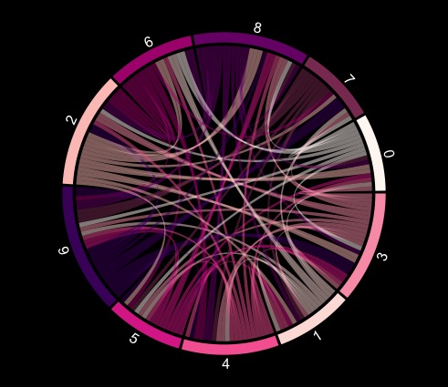

# 31415 Digits of Pi

Inspired from Martin Krzywinski visualization, I have created a chord chart as data art to depict first 31,415 digits of pi. The visualization shows connections between each digit with an assigned colour to each number. The wheel starts at 3 with the next number being the new unique digit in the string of pi digits. 

